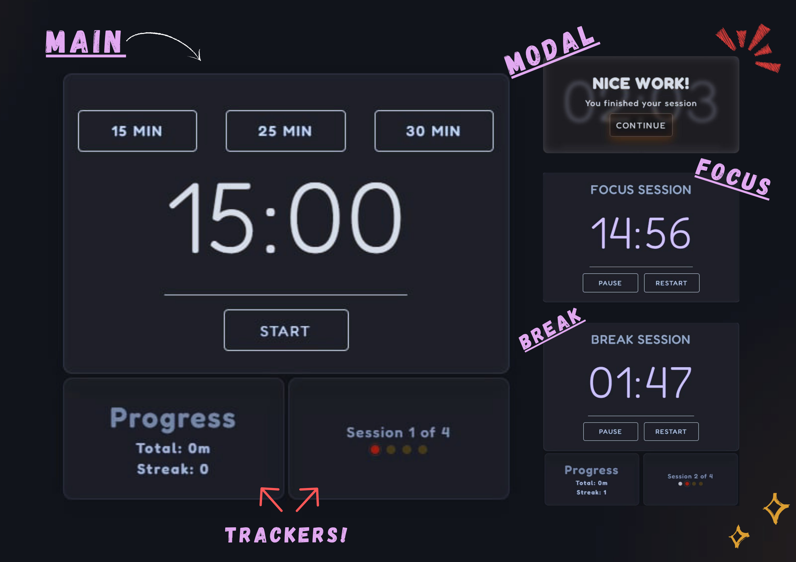

# Pomodoro App Project
I decided to make this project because I enjoy using the Pomodoro technique, and I realized I could build one myself.

### v1.0 - June 2026
This is currently the first version of the project. It doesn’t have many features yet, but it’s fully functional, and I plan to improve it step by step.

- 25 minutes Pomodoro.
- 5-minutes break.
- 4 Pomodoro sessions per cycle (100 minutes of focus time and 20 minutes of breaks).
- Background music during focus and break sessions
- Start, Pause, and Restart controls

## PREVIEW

---

### v1.1 - June 2026
Version 1.1 took one week to develop and required a lot of trial and error. For future versions, I plan to add a to-do list feature, improve the website's design, and introduce leaderboards. I am also planning to develop a mobile version of the application.

 - Local Storage Support
 - Better UI Animations
 - Time Choices (15, 25, and 30 minutes)
 - Progress Tracker

## PREVIEW

